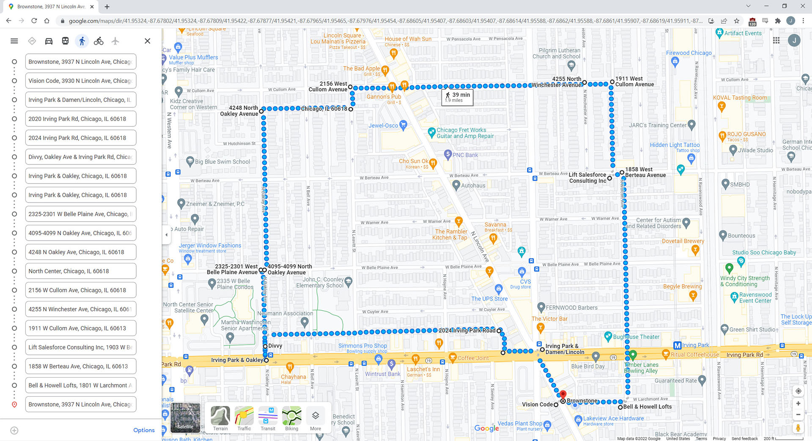
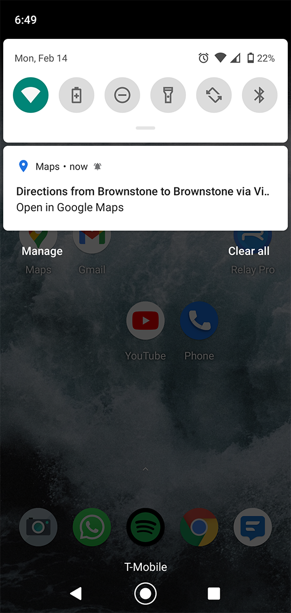
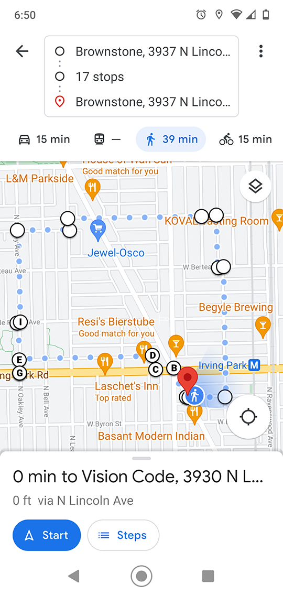

# openrouteservice + Google Maps Round Trip Creator for Running Routes

A quick and easy way to create running routes under 5 kilometers, pushed directly to your phone! No download of gpx files required!
| Desktop Preview... Automatically Pushed to Phone |
|--------------------------------------------------|
| |

| Phone Notification | Route Displayed on Phone |
|--------------------|--------------------------|
| |  |

## Description

Developed using the "openrouteservice" library and integrates into Google maps with any account that has a cellular device tied to it.

## Getting Started

### Dependencies

* Python 3.6+
* openrouteservice python module
* openrouteservice API key
* google account w/ associated mobile phone

### Installing

* Create a pull request or download this depository directly
* It is highly recommended to create a virtual environment before installing dependencies in the requirements.txt file

### Executing program

* To run from Python, first you must obtain an API key from openrouteservice. Then you must save your key to the operating system environment variables.
* The current limit on round trip routes using openrouteservice is 5 kilometers.

## Help

For openrouteservice help, use the openrouteservice documenation [here](https://openrouteservice-py.readthedocs.io/en/latest/)

## Authors

Contributors names and contact info

John Tisza  
[github](https://github.com/johntisza)

## Version History

* 0.1
    * Initial Release
